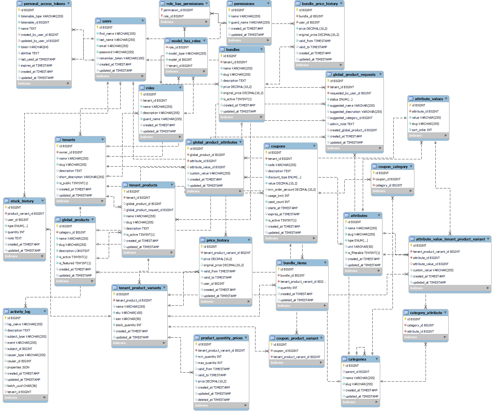

# Tenant App: multi-tenant product and price management

Master's thesis project (University of Žilina, Faculty of Management Science and Informatics, 2026):
*Inteligentný systém pre správu cien tovaru* (An intelligent system for managing product prices).

A multi-tenant web application where several sellers manage their products, prices and stock on one
platform while their data stays isolated. Sellers attach their own products and variants to a shared
central catalog, define pricing rules, and publish the data through a REST API and XML feeds.

## Features

- **Multi-tenancy**: single database with a `tenant_id` on tenant data. Isolation is enforced by the
  Filament tenant panel, access middleware, policies and tenant-scoped roles (spatie/laravel-permission with teams).
- **Central catalog**: global products, categories and attributes managed by the platform admin.
  Tenants can request new catalog products, and the admin approves them.
- **Seller products and variants**: SKU, EAN, attributes, stock with full stock history.
- **Pricing**
  - price history with validity windows and flash sales
  - quantity discounts (price tiers by quantity)
  - coupons (fixed or percentage, minimum order, usage limit, validity period, product/category scope)
  - product bundles with their own price history
- **REST API** (`/api/v1/{tenant}/...`): products, variants, prices, stock, bundles, coupons, categories,
  search and reports. Token auth per tenant with per-ability permissions and rate limiting.
  OpenAPI documentation is generated with Scramble.
- **XML feeds**: Heureka and generic format, served from a tokenized URL `/feed/{tenant}/{token}.xml`.
- **Import and export** of catalog, products, variants and users (Filament importers and exporters).
- **Extras**: price prediction and stock recommendations (php-ml), AI-generated product descriptions (Gemini),
  activity log, public storefront with product comparison.

## Tech stack

PHP 8.4, Laravel 12, Filament 5, Livewire 4, MySQL 8, Tailwind CSS 4, Alpine.js, Vite,
Laravel Sanctum, spatie/laravel-permission, spatie/laravel-activitylog, spatie/laravel-medialibrary,
dedoc/scramble, PHPUnit, Larastan (PHPStan). Deployed to Azure App Service through GitHub Actions.

## Database model



## Running locally

Requirements: PHP 8.4, Composer, Node.js, MySQL 8 (or Docker).

```bash
# create a MySQL database named "tenantapp" first, then:
composer setup          # install, copy .env, generate key, migrate, build assets
php artisan db:seed     # demo tenants, catalog, products, bundles, coupons
composer dev            # app server, queue worker and Vite together
```

With Docker (Laravel Sail), after `composer install`:

```bash
./vendor/bin/sail up -d
./vendor/bin/sail artisan migrate --seed
```

`GEMINI_API_KEY` in `.env` is only needed for AI-generated descriptions.

Demo accounts created by the seeder (local use only):

| Role | E-mail | Password |
|------|--------|----------|
| Platform admin | admin@admin.com | password |
| Shop owner (several tenants) | test@test.com | password |

Admin panel: `/admin`, tenant panel: `/tenant`.

## Tests

```bash
composer test
```

Around 110 tests: API endpoints (auth, products, stock, prices, coupons, bundles), XML feeds,
policies and role access, and unit tests for pricing, coupons and the prediction services.
Tests run against a MySQL database `tenantapp_test` (see `phpunit.xml`).

Static analysis: `./vendor/bin/phpstan analyse` (level 5).
